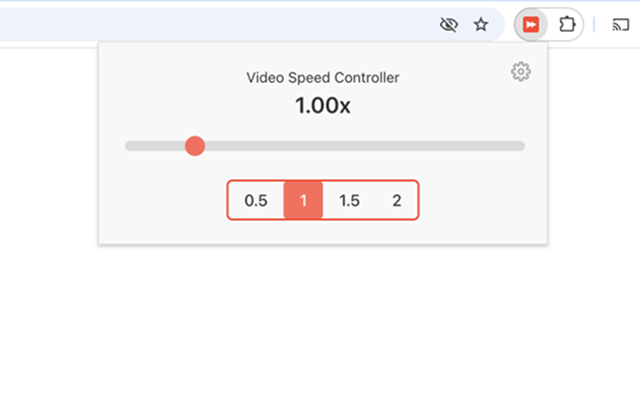
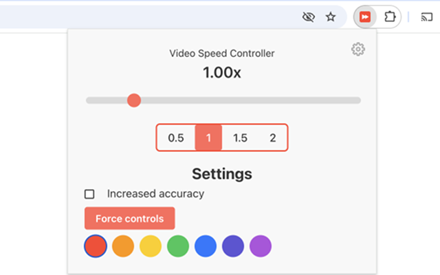
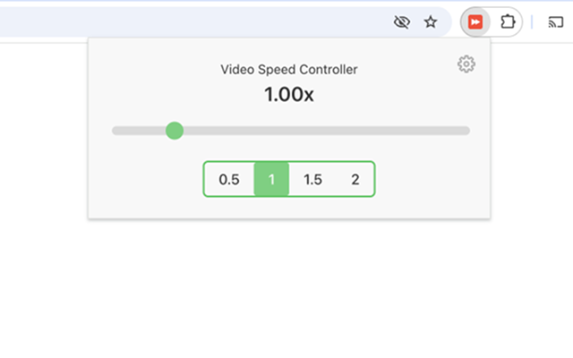
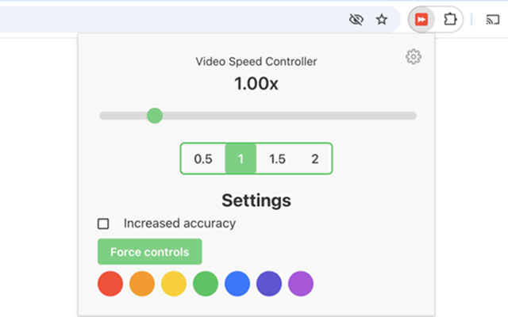

#  Video Speed Controller

Video Speed Controller is a super lightweight extension that lets you control video playback speed on any website. Easily slow down or speed up videos up to 5x for a customized viewing experience!

## Features:

- Adjust video speed from 0.01x to 5.00x
- Quick-access buttons for 0.5x, 1x, 1.5x, and 2x speeds
- Works seamlessly on all websites with embedded videos

|  |  |
| ----------------------------------------------- | -------------------------------------------------------- |
|  |  |

## Install

[**Chrome** extension](https://chrome.google.com/webstore/detail/videospeedcontroller/oedcflfijnmdnkllbeoacabinnlgplmb)

## Contribution

Suggestions and pull requests are welcomed!.
